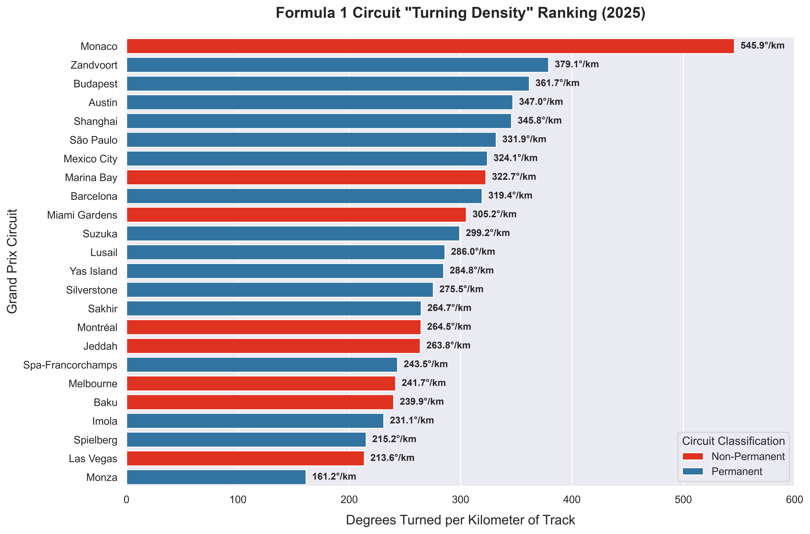

# Turning_Density_F1
Analysis and visualizations of Formula 1 Circuit ***Turning Densities***

## Description
The proposed ***Turning Density*** metric is defined as the cumulative absolute change in vehicle path heading normalized by lap distance. Therefore, higher values indicate tighter, more directionally complex circuits, while lower values indicate straighter or more flowing circuits.
- `turning_density.py` computes, plots, and stores *Turning Density* charts for Formula 1 circuits of any given year, based on telemetry data from all push/flying laps from qualifying. 
- The only required user input is the calendar year/season you would like to run (the `year` variable at the very top of the script).

## Outputs
- A CSV file containing the computed *Turning Density* (in deg/km) and corresponding rank, as well as the total turning (in degrees) and total distance (in km) used to calculate *Turning Density*
- A bar chart ranking all circuits by *Turning Density*, color-coded by circuit type (permanent vs. non-permanent)
- A pictorial grid of circuit maps colored by qualifying speed, ordered from top-left to bottom-right by *Turning Density* (highest to lowest)

## Methodology
- This code uses data from all valid qualifying push laps as follows: 
    1. Total turning and distance values were taken as the median computed over all valid push laps. The median was used rather than the mean because a small number of laps on some circuits contained telemetry artifacts which inflated total turning values.
    2. Speed traces are averaged to get an accurate speed profile throughout the lap, robust against data dropouts from a handful of cars' 'Speed' data (which turned out to be fairly common). These are only used for coloring the map images. Laps more than 5% slower than the fastest lap of qualifying were ignored.

## Limitations
- *Turning Density* is computed from [Fast-F1](https://github.com/theOehrly/Fast-F1) X/Y position channels, which are local track-position coordinates. However, as [theOehrly stated](https://github.com/theOehrly/Fast-F1/discussions/116), these locations are "normalized track positions", which "tend to approximately follow the ideal racing line around a circuit". Unfortunately, they are not actual GPS racing lines, but they seem to be the best data available. 
- Small variations (+/-0.5%) in *Turning Density* exist from year-to-year, based on the telemetry X/Y position data mappings.

## Requirements
This script requires Python along with:
- fastf1
- numpy
- pandas
- matplotlib
- seaborn

## Example Results from 2025:

